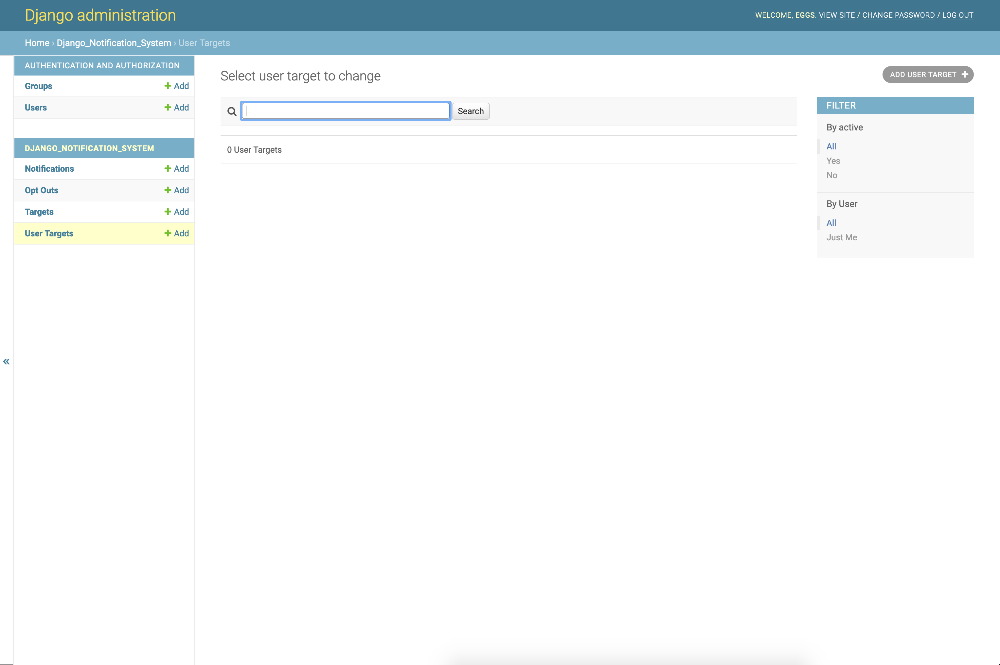

Notification Management Commands
================================
Create Email User Targets
-------------------------
The purpose of this command is to retroactively create an email user target for each user
currently in your database. After initial installation of this package, we can see that the ``User Targets`` section
of our admin panel is empty.

Oh no!

FEAR NOT! In your terminal, run the command:

.. parsed-literal::
        $ python manage.py create_email_user_targets

After the command has been run, navigate to ``http://localhost/admin/django_notification_system/usertarget/``.
You should see a newly created UserTarget for each user currently in the DB.

.. figure::  images/create_email_user_targets/create_email_user_targets_2.png
    :align:   center
    :scale: 25%

These user targets are now available for you to send notifications to.

Process Notifications
---------------------
# TODO