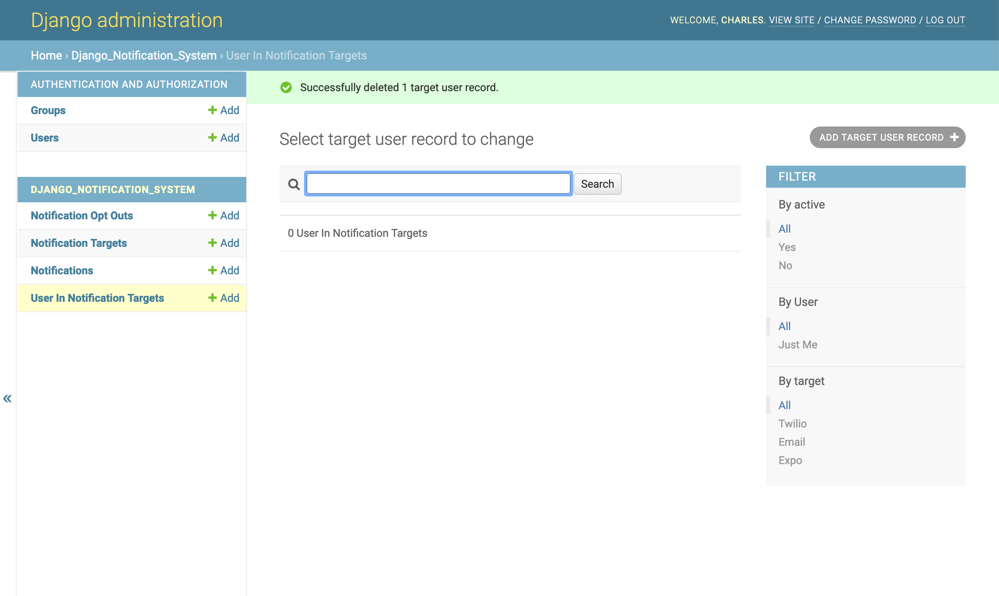
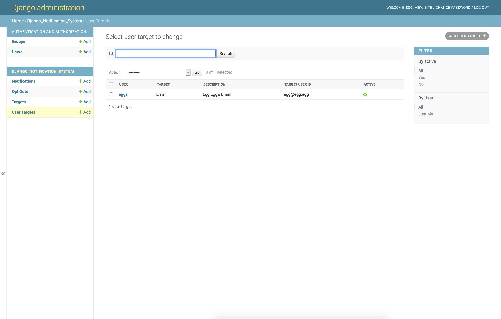

Django Notification System Management Commands
==============================================
Create Email Target User Records
--------------------------------
The purpose of this command is to retroactively create an email target user record for each user
currently in your database. After initial installation of this package, we can see that the ``User Targets`` section
of our admin panel is empty.

Oh no!

FEAR NOT! In your terminal, run the command:

.. parsed-literal::
        $ python manage.py create_email_target_user_records

After the command has been run, navigate to ``http://localhost/admin/django_notification_system/usertarget/``.
You should see a newly created UserInNotificationTarget for each user currently in the DB.

These user targets are now available for all of your notification needs.

Process Notifications
---------------------
The purpose of this command is to send out all notifications scheduled for delivery before the current 
date and time.

First, we'll need to have some Notifications in our database in order for this command to send anything.

**Creating Notifications**

        .. code-block:: python
                
                from django.contrib.auth import get_user_model
                from django.utils import timezone
                
                from django_notification_system.models import UserInNotificationTarget, Notification

                User = get_user_model()
                
                user = User.objects.get(first_name="Eggs", last_name="Benedict")

                # Let's assume this user has 3 UserInNotificationTarget objects, one for Expo, one for Twilio and
                # one for Email.
                user_targets = UserInNotificationTarget.objects.filter(
                    user=user)

                # We'll loop through these targets and create a basic Notification for each one.
                for user_target in user_targets:
                    Notification.objects.create(
                        user_target=user_target,
                        title=f"Test notification for {user.first_name} {user.last_name}",
                        body="lorem ipsum...",
                        status="SCHEDULED,
                        scheduled_delivery=timezone.now()
                    )

Now we have three Notifications ready to send. Sending these is as simple as running this command:

.. parsed-literal::
        $ python manage.py process_notifications

After running this command, you should see the following output in your terminal:

.. parsed-literal::
        egg - 2020-12-06 19:57:38+00:00 - SCHEDULED
        Test notification for Eggs Benedict - lorem ipsum...
        SMS Successfully sent!
        *********************************
        egg - 2020-12-06 19:57:38+00:00 - SCHEDULED
        Test notification for Eggs Benedict - lorem ipsum...
        Email Successfully Sent
        *********************************
        egg - 2020-12-06 19:57:38+00:00 - SCHEDULED
        Test notification for Eggs Benedict - lorem ipsum...
        Notification Successfully Pushed!
        *********************************

If all was successful, you will see the above output. This means that everything succeeded, all Notifications
that were sent have been updated to have a ``status`` of 'DELIVERED' with an ``attempted_delivery`` to the time it was sent.
If any error occurs, that will be captured in the output. Based on the retry attributes, the notification will try sending
the next time the command is called.