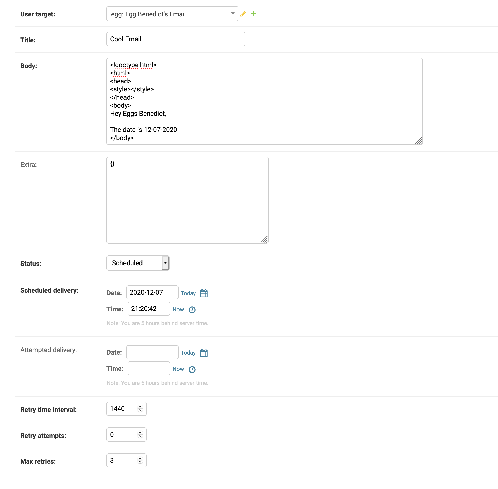
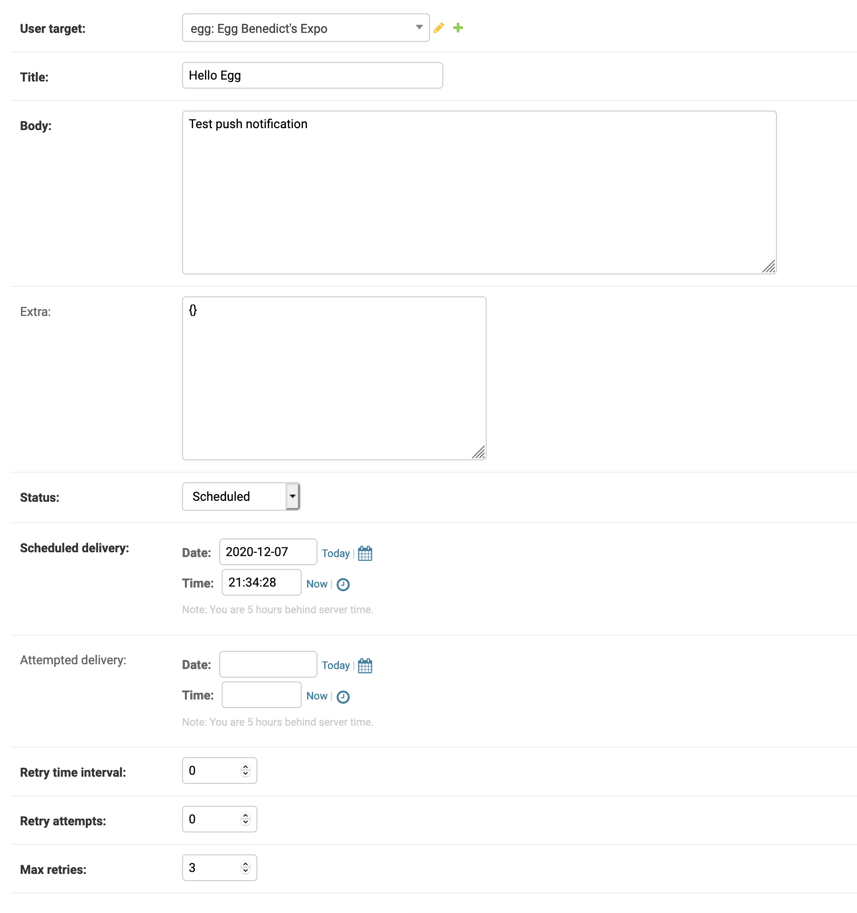
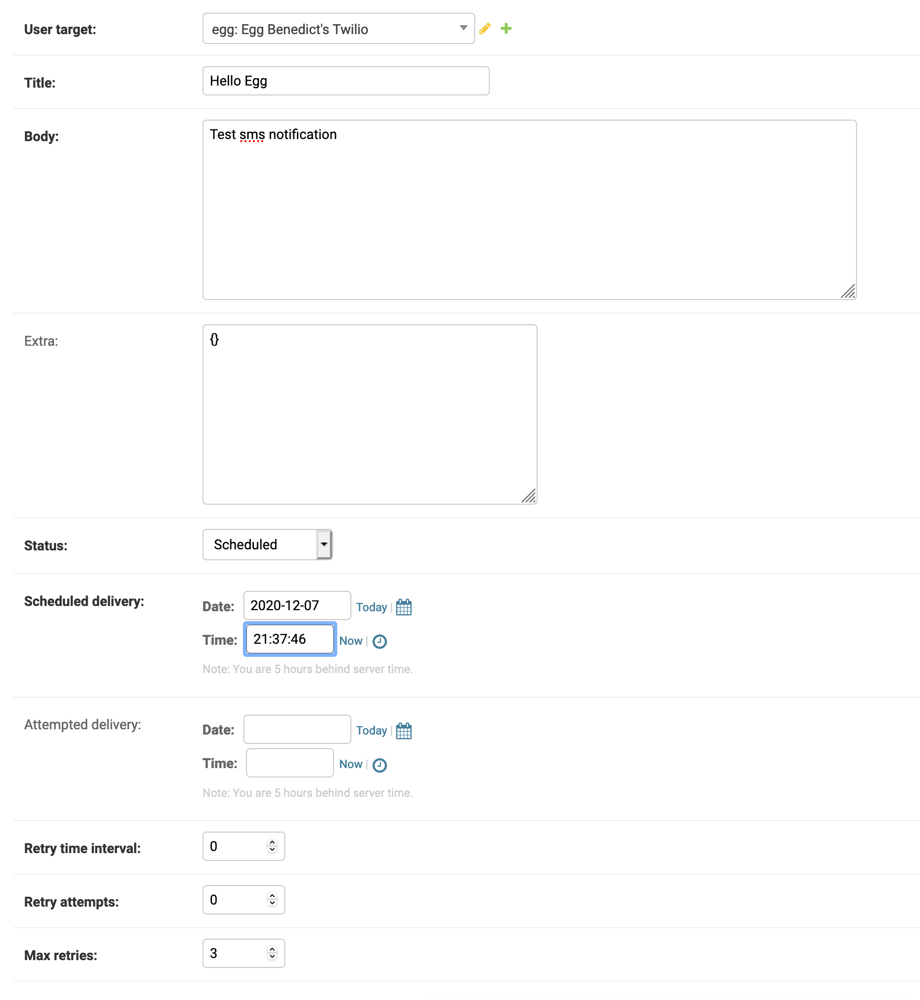

Django Notification System Utility Functions
============================================
In order to take some of the guess work out of the creation and handling of notifications for the 3
target types currently supported (Email, Twilio SMS and Expo Push), we have some utility functions!

Notification Creator Functions
++++++++++++++++++++++++++++++

Email
-----
**Import example**
        .. code-block:: python
                
                from django_notification_system.notification_creators.email import create_notification

**Parameters**
    =================== ================== =========================================================
    **Key**             **Type**           **Description**
    user                Django User        The user to whom the notification will be sent.
    title               str                The title for the notification.
    body                str                Body of the email. Defaults to a blank string if 
    
                                           not given. Additionally, if this parameter is not 
                                           
                                           specific AND "template_name" is present in `extra`, 
                                           
                                           an attempt will be made to generate the body from 
                                           
                                           that template.
    
    scheduled_delivery  datetime(optional) When to delivery the notification. Defaults to 
    
                                           immediately.
    
    retry_time_interval int(optional)      When to retry sending the notification if a delivery
                                           
                                           failure occurs. Defaults to 1440 seconds.
    
    max_retries         int(optional)      Maximum number of retry attempts. 
    
                                           Defaults to 3.
    
    quiet               bool(optional)     Suppress exceptions from being raised. 
    
                                           Defaults to False.
    
    extra               dict(optional)     User specified additional data that will be used 
    
                                           to populate an HTML template if 
                                           
                                           "template_name" is present inside.
    =================== ================== =========================================================

**Example Usage**
        .. code-block:: python
                
                from django.contrib.auth import get_user_model

                from django_notification_system.notification_creators.email import create_notification

                User = get_user_model()

                user = User.objects.get(first_name="Eggs", last_name="Benedict")

                create_notification(
                    user=user,
                    title='Cool Email',
                    extra={
                        "user": user,
                        "date": "12-07-2020"
                        "template_name": "templates/eggs_email.html"
                    })

The above example will create a Notification with the following values:

Expo
----
**Import example**
        .. code-block:: python
                
                from django_notification_system.notification_creators.expo import create_notification

**Parameters**
    =================== ================== =========================================================
    **Key**             **Type**           **Description**
    user                Django User        The user to whom the notification will be sent.
    title               str                The title for the push notification.
    body                str                The body of the push notification.
    scheduled_delivery  datetime(optional) When to delivery the notification. Defaults to 
    
                                           immediately.
    
    retry_time_interval int(optional)      Delay between send attempts. Defaults to 60 seconds.
    max_retries         int(optional)      Maximum number of retry attempts. 
    
                                           Defaults to 3.
    
    quiet               bool(optional)     Suppress exceptions from being raised. 
    
                                           Defaults to False.
    
    extra               dict(optional)     Defaults to None.
    =================== ================== =========================================================

**Example Usage**
        .. code-block:: python
                
                from django.contrib.auth import get_user_model

                from django_notification_system.notification_creators.expo import create_notification

                User = get_user_model()

                user = User.objects.get(first_name="Eggs", last_name="Benedict")

                create_notification(
                    user=user,
                    title=f"Hello {user.first_name}",
                    body="Test push notification")

The above example will create a Notification with the following values:

Twilio
------
**Import example**
        .. code-block:: python
                
                from django_notification_system.notification_creators.twilio import create_notification

**Parameters**
    =================== ================== =========================================================
    **Key**             **Type**           **Description**
    user                Django User        The user to whom the notification will be sent.
    title               str                The title for the sms notification.
    body                str                The body of the sms notification.
    scheduled_delivery  datetime(optional) When to deliver the notification. Defaults to 
    
                                           immediately.
    
    retry_time_interval int(optional)      Delay between send attempts. Defaults to 60 seconds.
    max_retries         int(optional)      Maximum number of retry attempts. 
    
                                           Defaults to 3.
    
    quiet               bool(optional)     Suppress exceptions from being raised. 
    
                                           Defaults to False.
    
    extra               dict(optional)     Defaults to None.
    =================== ================== =========================================================

**Example Usage**
        .. code-block:: python
                
                from django.contrib.auth import get_user_model

                from django_notification_system.notification_creators.twilio import create_notification

                User = get_user_model()

                user = User.objects.get(first_name="Eggs", last_name="Benedict")

                create_notification(
                    user=user,
                    title=f"Hello {user.first_name}",
                    body="Test sms notification")

The above example will create a Notification with the following values:

